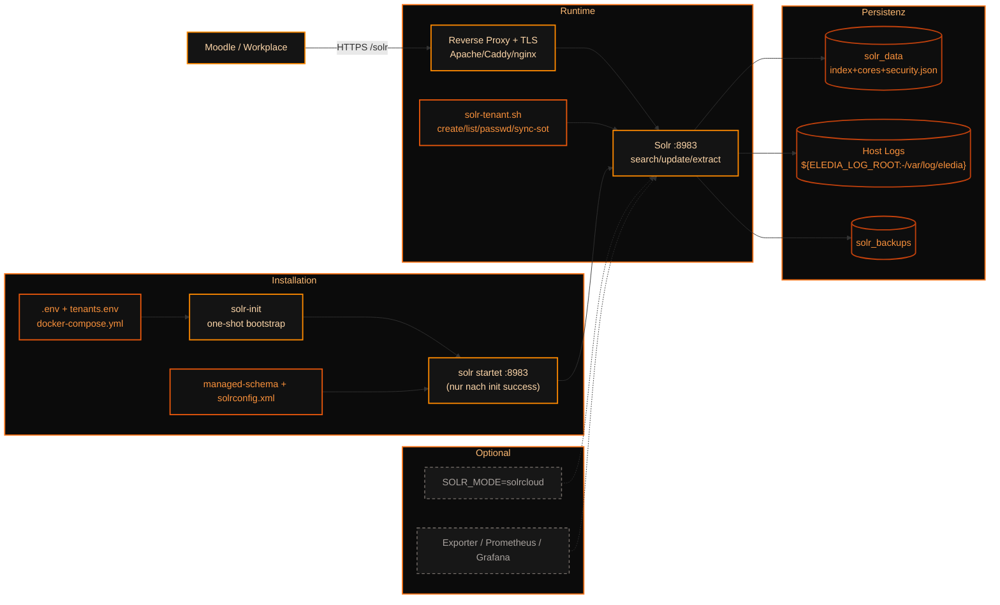

# Solr für Moodle — Multi-Tenant

[](https://github.com/Codename-Beast/solr-moodle-docker/actions/workflows/solr-testing.yml)


Docker-Stack für Solr + Moodle Global Search mit Multi-Tenant-Isolation.

- Standalone oder optional SolrCloud
- Tenant-User + Core/Collection-Isolation
- Tika `/update/extract` für Datei-Indexierung
- CI für Standalone und SolrCloud

---
Siehe [CHANGELOG.md](CHANGELOG.md) für alle Changes aus allen Branch-Linien.

## Architektur: Installation + Runtime



Installationsprozess (kurz):
1. `.env` und `tenants.env` pflegen.
2. `docker compose up -d --build` startet zuerst `solr-init`.
3. `solr-init` legt Security/Bootstrap ab; danach startet Solr.
4. Schema/Config (`managed-schema`, `solrconfig.xml`) ist aktiv.

Runtime-Prozess (klar getrennt):
- Moodle geht ausschließlich per HTTPS über Reverse Proxy auf Solr.
- Tenant-Operationen laufen über `solr-tenant.sh` (inkl. `sync-sot`).
- Solr schreibt in `solr_data`, Host-Logs und Backups.
- SolrCloud + Monitoring bleiben optional.

Hinweis: In diesem Repo wird bewusst nur die Docker-Instanz dargestellt (kein Ansible).

## Schnellstart

```bash
git clone https://github.com/Codename-Beast/solr-moodle-docker
cd solr-moodle-docker
cp .env.example .env
# Passwörter setzen (kein CHANGE_ME)
docker compose up -d --build
```

Healthcheck:

```bash
docker compose ps
curl -u "admin:<SOLR_ADMIN_PASSWORD>" "http://127.0.0.1:${SOLR_PORT:-8983}/solr/admin/info/system"
```

## Installationsprozess (code-nah)

1. `cp .env.example .env` und Pflichtpasswörter setzen.
2. `docker compose up -d --build` startet den Stack.
3. `solr-init` läuft einmalig und erzeugt Bootstrap/Security-Artefakte.
4. Erst danach startet `solr` (abhängig von erfolgreichem Init-Exit).
5. Verifikation über `docker compose ps` und `.../solr/admin/info/system`.

## Runtime-Prozess (code-nah)

- Zugriffspfad: Moodle -> Reverse Proxy (TLS) -> `127.0.0.1:${SOLR_PORT:-8983}`.
- Tenant-Verwaltung: `scripts/solr-tenant.sh` (`create/list/passwd/sync-sot`).
- SoT-Abgleich: `.env + tenants.env -> Solr API` via `sync-sot`.
- Persistenz: `solr_data` (Index/Cores/Security), Host-Logs, `solr_backups`.
- Optional: `SOLR_MODE=solrcloud` fuer Collections-basierten Betrieb.

## Multi-Tenant Basics

```bash
# Tenant anlegen
docker compose exec -T solr /opt/solr/scripts/solr-tenant.sh create schule_a --cores moodle_prod_a,moodle_test_a

# Liste
docker compose exec -T solr /opt/solr/scripts/solr-tenant.sh list

# Passwort rotieren
docker compose exec -T solr /opt/solr/scripts/solr-tenant.sh passwd schule_a

# Source-of-Truth Sync (.env + tenants.env -> Solr API)
docker compose exec -T solr /opt/solr/scripts/solr-tenant.sh sync-sot
```

## SolrCloud (optional)

In `.env`:

```bash
SOLR_MODE=solrcloud
```

Danach neu starten:

```bash
docker compose up -d --build
```

## Tests

```bash
./scripts/run-tests.sh
./scripts/test-moodle-documents.sh
```

## Wichtige Hinweise

- `SOLR_BIND=127.0.0.1` beibehalten, extern nur über Proxy.
- `tenants.env` enthält Secrets und bleibt unversioniert.
- Monitoring ist optional; Doku bleibt verfügbar, aber aktuell kein aktiver Ausbau.

## Struktur

- `config/managed-schema`
- `config/solrconfig.xml`
- `scripts/solr-tenant.sh`
- `scripts/run-tests.sh`
- `scripts/test-moodle-documents.sh`
- `docs/`
