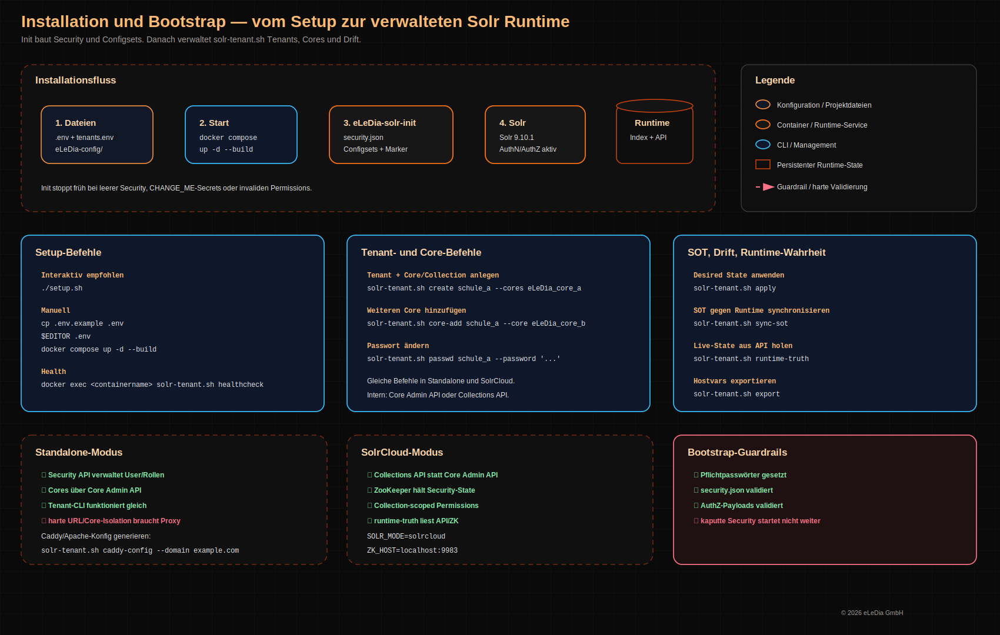

# Solr für Moodle — Multi-Tenant Docker Stack


Ein Solr-Stack für Moodle Global Search, gebaut für mehrere Moodle-Instanzen auf einem Solr. Jeder Tenant bekommt eigene Zugangsdaten und nur Zugriff auf die eigenen Cores oder Collections. Datei-Inhalte laufen über Tika, der Betrieb geht wahlweise als Standalone oder SolrCloud.

Kurz gesagt: ein Setup, das man installieren, testen und später noch verstehen kann.

> Solr ist standardmäßig nur auf `127.0.0.1` gebunden. Externe Zugriffe gehören über einen Reverse Proxy mit TLS davor.

---

## Inhalt

| Bereich | Links |
|---|---|
| 🚀 Start | [Voraussetzungen](#-voraussetzungen) · [Schnellstart](#-schnellstart) |
| 🧱 Aufbau | [Architektur](#-architektur) · [Verzeichnisstruktur](#-verzeichnisstruktur) |
| ⚙ Betrieb | [Tenant-Verwaltung](#-tenant-verwaltung) · [SolrCloud](#-solrcloud) · [Konfiguration](#-konfiguration) |
| 🔐 Qualität | [Sicherheit](#-sicherheit) · [Tests](#-tests) |
| 📚 Doku | [Weitere Dokumentation](#-weitere-dokumentation) · [Kompatibilität](#kompatibilität) |

---

## 🚀 Voraussetzungen

| Komponente | Minimum |
|---|---|
| Docker | 24+ inkl. Compose-Plugin |
| Solr | 9.10.1, im Image enthalten |
| Moodle | 4.1 bis 5.x |

---

## 🚀 Schnellstart

```bash
git clone <repo-url>
cd solr-moodle-docker
```

### Empfohlen: interaktives Setup

```bash
./setup.sh
```

Das Skript fragt die wichtigsten Werte ab, erzeugt Passwörter, baut die Images und startet den Stack.

### Manuell

```bash
cp .env.example .env
$EDITOR .env
docker compose up -d --build
```

Vor dem Start müssen die Pflichtpasswörter in `.env` gesetzt sein. Platzhalter wie `CHANGE_ME` werden beim Start abgewiesen.

### Health-Check

```bash
docker compose ps
docker exec solr-solr /opt/solr/scripts/solr-tenant.sh healthcheck
```

Der Compose-Healthcheck prüft nicht nur, ob Solr antwortet, sondern in SolrCloud auch, ob der Tenant-Zustand noch zum `tenants.env` passt.

---

## 🧱 Architektur



Der Stack ist bewusst in Init und Runtime getrennt:

| Container | Aufgabe |
|---|---|
| `eLeDia-solr-init` | legt `security.json`, Configsets und Bootstrap-Metadaten an |
| `solr` | läuft dauerhaft und stellt Solr für Moodle bereit |

Der Runtime-Container startet erst, wenn der Init-Container sauber durch ist. Dadurch ist die Security-Basis schon vorhanden, bevor Solr für Moodle erreichbar wird.

```text
Moodle -> Reverse Proxy -> 127.0.0.1:${SOLR_PORT} -> Solr Core/Collection
```

Details zu ZooKeeper, Security API und Persistenz: [docs/architecture-runtime.svg](docs/architecture-runtime.svg)

---

## ⚙ Tenant-Verwaltung

Jede Moodle-Instanz ist ein eigener Tenant. Praktisch heißt das: eigener Solr-User, eigenes Passwort, eigene Cores oder Collections.

### Tenant anlegen

```bash
docker exec solr-solr \
  /opt/solr/scripts/solr-tenant.sh create schule_a --cores moodle_prod
```

### Tenants anzeigen

```bash
docker exec solr-solr /opt/solr/scripts/solr-tenant.sh list
```

### Passwort rotieren

```bash
docker exec solr-solr /opt/solr/scripts/solr-tenant.sh passwd schule_a
```

### Explizites Passwort setzen

Nützlich, wenn Ansible oder ein anderes Deployment-Tool den Wert vorgibt:

```bash
docker exec solr-solr \
  /opt/solr/scripts/solr-tenant.sh passwd schule_a --password '<neues-passwort>'
```

### Source of Truth anwenden

```bash
docker exec solr-solr /opt/solr/scripts/solr-tenant.sh sync-sot
```

### Permissions neu aufbauen

```bash
docker exec solr-solr /opt/solr/scripts/solr-tenant.sh rebuild-permissions
```

### Drift prüfen und beheben

```bash
docker exec solr-solr /opt/solr/scripts/solr-tenant.sh drift-detect
docker exec solr-solr /opt/solr/scripts/solr-tenant.sh drift-remediate
```

### Hostvars exportieren

```bash
docker exec solr-solr /opt/solr/scripts/solr-tenant.sh export
```

Der Export enthält auch `solr_runtime_source_of_truth`. Das ist wichtig, wenn später nachvollziehbar bleiben soll, was wirklich aus der Solr API oder aus ZooKeeper kam.

---

## ☁ SolrCloud

SolrCloud ist der Default. Der Modus wird in `.env` gesetzt:

```bash
SOLR_MODE=solrcloud
ZK_MAX_CNXNS=60
```

| Thema | Standalone | SolrCloud |
|---|---|---|
| Setup | einfacher | etwas mehr bewegliche Teile |
| Isolation | Security + Proxy-Regeln | Collections + Security API |
| Skalierung | einzelner Node | mehrere Nodes möglich |

Ein paar Dinge, die im Betrieb relevant sind:

- Die interne Collection `.system` wird beim Start angelegt, falls sie fehlt.
- `SOLR_PORT` bleibt dynamisch. Mehrere Instanzen können parallel laufen.
- Moodle nutzt in SolrCloud Collections statt Cores. Die Tenant-Befehle bleiben gleich.

Nach einem Moduswechsel:

```bash
docker compose up -d --build
```

---

## ⚙ Konfiguration

Alle Optionen stehen in `.env.example`. Die wichtigsten Werte:

| Variable | Default | Bedeutung |
|---|---|---|
| `STACK_VERSION` | `v3.4.10` | Tag für das Init-Image, passend zum Changelog halten |
| `INSTANCE_NAME` | `solr` | Präfix für Container, Volume und Network |
| `SOLR_VERSION` | `9.10.1` | Solr-Version im Runtime-Image |
| `SOLR_PORT` | `8983` | Solr-Port auf dem Host |
| `SOLR_BIND` | `127.0.0.1` | Bind-Adresse. Nicht auf `0.0.0.0` setzen. |
| `SOLR_HEAP` | `2g` | JVM Heap |
| `SOLR_MODE` | `solrcloud` | `solrcloud` oder `standalone` |
| `ELEDIA_LOG_ROOT` | `/var/log/eledia/solr` | Host-Root für Init-, Setup- und Runtime-Logs |
| `INIT_TARGETS` | `solr-a,solr-b,solr-c` | Metadaten für globalisierte Init-Läufe |
| `SOLR_ADMIN_PASSWORD` | leer | Pflichtwert |
| `SOLR_SUPPORT_PASSWORD` | leer | Pflichtwert |
| `TENANTS_ENV` | `/opt/solr/tenants.env` | Tenant-Source-of-Truth im Container |

---

## 🔐 Sicherheit

Ein paar Regeln sind hier bewusst hart gezogen:

- Solr bleibt lokal gebunden: `SOLR_BIND=127.0.0.1`.
- Externe Zugriffe laufen über Apache, Caddy oder einen anderen Reverse Proxy mit TLS.
- `CHANGE_ME`-Passwörter werden beim Start abgewiesen.
- Tenant-User bekommen nur die Rechte, die sie für ihre Cores oder Collections brauchen.
- In SolrCloud stehen tenant-spezifische Regeln vor generischen Regeln. Die Fallback-Permission `all` bleibt zuletzt.

---

## 🧱 Verzeichnisstruktur

```text
solr-moodle-docker/
├── docker-compose.yml          # Stack-Definition
├── .env.example                # Konfigurationsvorlage
├── Dockerfile                  # eLeDia-solr-init Bootstrap-Container
├── Dockerfile.solr             # Solr Runtime mit Tika-Modul
├── init/
│   ├── powerinit.sh            # Bootstrap: security.json + Configsets
│   └── security.json.template  # Init-Template für Security JSON
├── eLeDia-config/
│   ├── managed-schema          # Moodle-Felder + solr_filecontent
│   └── solrconfig.xml          # /update/extract Handler
├── scripts/
│   ├── solr-tenant.sh          # Tenant-CLI
│   ├── run-tests.sh            # Testsuite
│   └── test-moodle-documents.sh
├── .github/workflows/          # GitHub Actions
├── .gitlab-ci.yml              # GitLab CI
└── docs/                       # Betriebsdokumentation
```

---

## 🧪 Tests

| Zweck | Befehl |
|---|---|
| Unit-Tests | `./scripts/run-tests.sh --unit-only` |
| Stack-Test mit Tenant-Checks | `./scripts/run-tests.sh --tenant` |
| Nur Tenant-CLI-Vertrag | `./scripts/run-tests.sh --tenant-commands` |
| Moodle/Tika-Dokumentindexierung | `./scripts/test-moodle-documents.sh` |
| Moduswechsel Standalone/SolrCloud | `./scripts/run-tests.sh --mode-switch` *(lokaler Helfer, nicht Teil der GitLab-Pipeline)* |

Die CI baut Standalone und SolrCloud. Der Tenant-CLI-Pfad hängt an `run-tests.sh --tenant` und läuft damit in der regulären Pipeline mit.

---

## 📚 Weitere Dokumentation

| Dokument | Inhalt |
|---|---|
| [docs/architecture.md](docs/architecture.md) | Architektur, Komponenten, Tenant-Lifecycle |
| [docs/CI-CD.md](docs/CI-CD.md) | GitHub und GitLab CI |
| [docs/GITLAB-CI-CD-SETUP.md](docs/GITLAB-CI-CD-SETUP.md) | GitLab Runner Setup |
| [docs/GITLAB-QUICKSTART.md](docs/GITLAB-QUICKSTART.md) | GitLab Schnellstart |
| [docs/monitoring.md](docs/monitoring.md) | Prometheus und Loki Integration |
| [CHANGELOG.md](CHANGELOG.md) | Änderungshistorie |

---

## Kompatibilität

| Komponente | Version |
|---|---|
| Solr | 9.10.1 |
| Moodle | 4.1 bis 5.x |
| Docker | 24+ |

---

**eLeDia.de** · BSC Bernd Schreistetter
