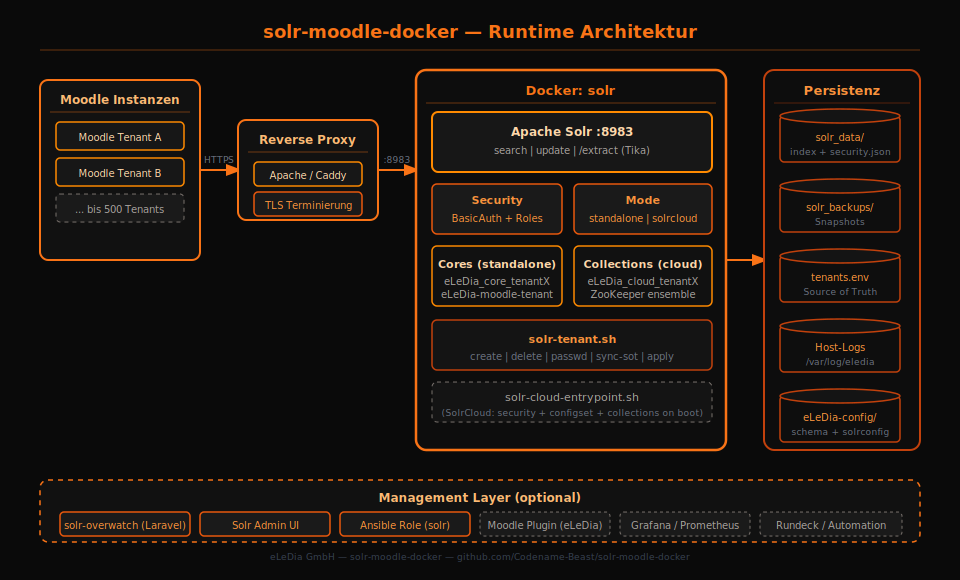

# Solr für Moodle — Multi-Tenant Docker Stack


Docker-Stack für Moodle Global Search mit Solr 9.10.1, Tika und Tenant-Isolation.
Jeder Tenant bekommt eigene Zugangsdaten und Zugriff auf die eigenen Cores oder Collections.

Solr bleibt standardmäßig auf `127.0.0.1` gebunden. Externe Zugriffe laufen über Reverse Proxy.

---

## Inhalt

| Bereich | Links |
|---|---|
| Start | [Voraussetzungen](#voraussetzungen) · [Schnellstart](#schnellstart) |
| Betrieb | [Architektur](#architektur) · [Reverse Proxy](#reverse-proxy) · [Moodle einstellen](#moodle-einstellen) |
| Tenants | [Tenant-Verwaltung](#tenant-verwaltung) · [SolrCloud](#solrcloud) |
| Qualität | [Sicherheit](#sicherheit) · [Tests](#tests) |
| Doku | [Weitere Dokumentation](#weitere-dokumentation) |

---

## Voraussetzungen

| Komponente | Minimum |
|---|---|
| Docker | 24+ inkl. Compose-Plugin |
| Solr | 9.10.1 |

---

## Schnellstart

```bash
git clone <repo-url>
cd solr-moodle-docker
./setup.sh

# Optional direkt beim Setup Tenants anlegen oder erweitern:
SETUP_TENANTS='schule_a:moodle_prod,moodle_test;schule_b:moodle_prod_b' ./setup.sh
```

Das Setup fragt die wichtigsten Werte ab, erzeugt Passwörter, baut die Images und startet den Stack. Interaktiv werden jetzt u. a. Instanzname, Hostname, Bind-Adresse, Port, Heap, Solr-Modus und Environment-Banner abgefragt. Die Oberfläche ist dabei klarer gegliedert und zeigt die gewählten Basiswerte direkt im Terminal an. Wenn `SETUP_TENANTS` gesetzt ist oder interaktiv eingegeben wird, legt das Setup die Tenants über den vorhandenen Container-Helper `solr-tenant.sh` an. In SolrCloud werden daraus Collections, im Standalone-Modus Cores. Nach dem Start kann direkt die Tenant-Verwaltung oder die neue Admin-/Ops-User-Verwaltung geöffnet werden.

Wenn der Stack bereits existiert und der `${INSTANCE_NAME}-solr`-Container vorhanden ist, startet `./setup.sh` nicht erneut die Installationsroutine, sondern öffnet direkt das Runtime-Management. Dort können Tenants verwaltet, zusätzliche nicht-tenantbezogene Admin-/Support-User über `admin-users.env` gepflegt, alle SOT-Dateien per `apply`/`sync-sot` in die Solr-Runtime synchronisiert, Drift geprüft oder behoben und Caddy-/Nginx-/Apache-Proxy-Wege eingerichtet werden. Wenn kein Container vorhanden ist, läuft die normale Installation weiter.

Zusätzliche System-User ohne Tenant-Bezug werden in `admin-users.env` verwaltet. Format pro User:

```text
ADMIN_alice_ROLE=admin
ADMIN_alice_PASS=<password>
ADMIN_bob_ROLE=support
ADMIN_bob_PASS=<password>
```

Für voll nicht-interaktive Setups kannst du sie auch direkt beim ersten Lauf setzen:

```bash
SETUP_ADMIN_USERS='alice:admin:Secret1234!;bob:support' ./setup.sh
```

Format: `user:role[:password]` mit `role=admin|support`. Ohne Passwort wird automatisch eines erzeugt.

Manuell:

```bash
cp .env.example .env
$EDITOR .env
docker compose up -d --build
```

Platzhalter wie `CHANGE_ME` werden beim Start abgewiesen.

Healthcheck:

```bash
docker compose ps
docker exec <containername> /opt/solr/scripts/solr-tenant.sh healthcheck
```

Der Compose-Healthcheck prüft Solr, Auth und Bootstrap-Zustand. Tenant-Drift wird separat mit `drift-detect` geprüft.

---

## Architektur




Der Stack trennt Bootstrap und Runtime:

| Container | Aufgabe |
|---|---|
| `eLeDia-solr-init` | schreibt `security.json`, Configsets und Bootstrap-Metadaten |
| `solr` | Runtime-Solr für Cores oder Collections |

Der Runtime-Container startet erst nach erfolgreichem Init.

```text
Moodle -> Reverse Proxy -> Solr Core/Collection
```

Details: [docs/architecture.md](docs/architecture.md)

---

## Reverse Proxy

Solr bleibt lokal gebunden (`SOLR_BIND=127.0.0.1`). Extern läuft der Zugriff über HTTPS.

| Proxy | Status | Konfiguration |
|---|---|---|
| Caddy | empfohlen | `docker compose -f docker-compose.proxy.yml --profile caddy up -d` |
| Apache | unterstützt | `./apache/generate-apache-config.sh` |
| Nginx | unterstützt | `docker compose -f docker-compose.proxy.yml --profile nginx up -d` oder `./nginx/generate-nginx-config.sh` |

Proxy als Container:

```bash
PROXY_HOSTNAME=kundendomain.de PROXY_SOLR_HOSTNAME=solr.kundendomain.de \
  docker compose -f docker-compose.proxy.yml --profile caddy up -d

PROXY_HOSTNAME=kundendomain.de PROXY_SOLR_HOSTNAME=solr.kundendomain.de \
  docker compose -f docker-compose.proxy.yml --profile nginx up -d
```

Damit ist Solr erreichbar über:

```text
https://kundendomain.de/solr
https://solr.kundendomain.de    # redirectet nach /solr/
```

Der Proxy-Container hängt automatisch am externen Netzwerk `${INSTANCE_NAME:-solr}-network`.
Default-Upstream: `${INSTANCE_NAME:-solr}-solr:${SOLR_PORT:-8983}`.

Abweichender Container oder Port:

```bash
SOLR_UPSTREAM=my-solr-container:18983 \
PROXY_HOSTNAME=kundendomain.de \
PROXY_SOLR_HOSTNAME=solr.kundendomain.de \
  docker compose -f docker-compose.proxy.yml --profile caddy up -d
```

Mehr: [proxy_guid.md](proxy_guid.md)

---

## Moodle einstellen

In Moodle unter `Website-Administration -> Plugins -> Suche -> Solr` bzw. `Global Search`:

| Moodle-Feld | Wert |
|---|---|
| Hostname | öffentlicher Proxy-Hostname oder interner Host |
| Port | `443` bei HTTPS über Proxy, sonst interner Solr-Port |
| Index name / Core / Collection | Core oder Collection des Tenants |
| Username | Tenant-User aus `tenants.env`, z. B. `solr_schule_a` |
| Password | Tenant-Passwort aus `tenants.env` |
| Secure / HTTPS | aktivieren, wenn Moodle Solr über `https://` erreicht |

Merksatz: Die Moodle-Secure-Option beschreibt die Verbindung von Moodle zum sichtbaren Solr-Endpunkt.
`https://` bedeutet Secure an, `http://` bedeutet Secure aus.

---

## Tenant-Verwaltung

Jede Moodle-Instanz ist ein Tenant: eigener User, eigenes Passwort, eigene Cores oder Collections.

```bash
# Tenant anlegen
docker exec <containername> /opt/solr/scripts/solr-tenant.sh create schule_a --cores moodle_prod

# Tenants anzeigen
docker exec <containername> /opt/solr/scripts/solr-tenant.sh list

# Passwort rotieren
docker exec <containername> /opt/solr/scripts/solr-tenant.sh passwd schule_a

# Explizites Passwort setzen
docker exec <containername> /opt/solr/scripts/solr-tenant.sh passwd schule_a --password '<neues-passwort>'

# Source of Truth anwenden
docker exec <containername> /opt/solr/scripts/solr-tenant.sh sync-sot

# Permissions neu aufbauen
docker exec <containername> /opt/solr/scripts/solr-tenant.sh rebuild-permissions

# Drift prüfen und beheben
docker exec <containername> /opt/solr/scripts/solr-tenant.sh drift-detect
docker exec <containername> /opt/solr/scripts/solr-tenant.sh drift-remediate

# Runtime-Wahrheit aus Solr API/ZooKeeper lesen
docker exec <containername> /opt/solr/scripts/solr-tenant.sh runtime-truth

# Hostvars aus tenants.env exportieren
docker exec <containername> /opt/solr/scripts/solr-tenant.sh export
```

`runtime-truth` liest den Live-Zustand aus der Solr Security API und in SolrCloud zusätzlich aus Collections API/ZooKeeper.

---

## SolrCloud

SolrCloud ist der Default:

```bash
SOLR_MODE=solrcloud
ZK_MAX_CNXNS=60
```

| Thema | Standalone | SolrCloud |
|---|---|---|
| Objekt | Core | Collection |
| Isolation | Security + Proxy-Regeln | Collections + Security API |
| Persistenz | Volume | Volume + ZooKeeper |

Die Tenant-Befehle bleiben in beiden Modi gleich.

---

## Konfiguration

Die wichtigsten Werte aus `.env.example`:

| Variable | Default | Bedeutung |
|---|---|---|
| `STACK_VERSION` | `v3.4.12` | Init-Image-Tag |
| `INSTANCE_NAME` | `solr` | Präfix für Container, Volume und Network |
| `SOLR_VERSION` | `9.10.1` | Solr-Version |
| `SOLR_PORT` | `8983` | Solr-Port auf dem Host |
| `SOLR_BIND` | `127.0.0.1` | Bind-Adresse, nicht öffentlich öffnen |
| `SOLR_HEAP` | `2g` | JVM Heap |
| `SOLR_MODE` | `solrcloud` | `solrcloud` oder `standalone` |
| `ELEDIA_LOG_ROOT` | `/var/log/eledia/solr` | Host-Root für Logs |
| `TENANTS_ENV` | `/opt/solr/tenants.env` | Tenant Source of Truth im Container |

---

## Sicherheit

- Solr bleibt lokal gebunden.
- Externe Zugriffe laufen über TLS-Proxy.
- Tenant-User bekommen nur Rechte für ihre Cores oder Collections.
- Pflichtpasswörter müssen gesetzt sein.
- Basic Auth wird an Solr weitergereicht.

---

## Verzeichnisstruktur

```text
solr-moodle-docker/
├── docker-compose.yml          # Stack
├── docker-compose.proxy.yml    # Caddy/Nginx als Proxy-Container
├── .env.example                # Konfigurationsvorlage
├── Dockerfile                  # eLeDia-solr-init
├── Dockerfile.solr             # Solr Runtime mit Tika
├── init/                       # Bootstrap
├── eLeDia-config/              # Moodle-Schema und Solr config
├── scripts/                    # Tenant-CLI und Tests
├── apache/                     # Apache-Generator
├── nginx/                      # Nginx-Generator und Container-Template
├── caddy/                      # Caddyfile für Container-Proxy
└── docs/                       # Betriebsdokumentation
```

---

## Tests

| Zweck | Befehl |
|---|---|
| Unit-Tests | `./scripts/run-tests.sh --unit-only` |
| Stack mit Tenant-Checks | `./scripts/run-tests.sh --tenant` |
| Tenant-CLI | `./scripts/run-tests.sh --tenant-commands` |
| Moodle/Indexierung | `./scripts/test-moodle-documents.sh` |
| SolrCloud Scale | `./scripts/run-tests.sh --cloud --tenant --tenant-scale --no-performance` |

Die CI prüft Lint, Security Scan, Standalone und SolrCloud inklusive Tenant-Isolation.

### Manuell verifizierter Setup-/Moodle-E2E-Test für 3.4.12

Zusätzlich zu den Unit-Tests wurde das neue interaktive Setup in einem isolierten Workspace real gegen Docker ausgeführt:

- Workspace: `/tmp/solr-setup-interactive-test`
- Instanz: `itestsolr`
- Host-Bind: `127.0.0.1:19083`
- Modus: `solrcloud`
- Tenant für Moodle-E2E: `moodle_e2e` mit Collection/Core `eLeDia_core`
- Docker-Moodle-Teststack: `/tmp/moodle-solr-e2e`, URL `http://127.0.0.1:18084`

Nachweise aus dem Lauf:

- Solr-Container `itestsolr-solr` lief `healthy`.
- `solr-tenant.sh healthcheck` meldete erfolgreich `system=200 auth=401 mode=solrcloud`.
- `solr-tenant.sh runtime-truth` zeigte die live vorhandenen Tenants/Collections.
- `tenants.env` wurde für UID `8983` schreibbar gemacht. Root-Installationen nutzen `chown 8983:8983` + `660`; nicht-root Installationen nutzen ACL `u:8983:rw,m::rw`; nur als letzte Fallback-Option wird `666` gesetzt.
- Moodle 4.5.10 wurde als Docker-Container mit PHP-Solr-Extension installiert und über die Moodle-CLI auf `itestsolr-solr:19083`, User `solr_moodle_e2e`, Index `eLeDia_core` konfiguriert.
- Moodle-Solr-Schema-Setup lief erfolgreich (`schema setup done`). Wichtig: der Stack stellt das Configset bereit; Moodle muss beim ersten Verbinden trotzdem seine Search-Engine-/Schema-Initialisierung gegen den Ziel-Core ausführen.
- Moodle Global Search Indexing lief erfolgreich und erzeugte Solr-Dokumente.
- Direkte Solr-Abfrage auf den Moodle-Testmarker lieferte Treffer in `core_course-course`.
- Moodle-Dateiindexierung wurde mit echten Ressourcen geprüft: PDF, DOCX und PPTX wurden in einen Moodle-Kurs hochgeladen, über `search/cli/indexer.php --force` indexiert und anschließend sowohl direkt in Solr (`solr_filecontent`) als auch über Moodle Global Search gefunden.
- Nachgewiesene Inhaltsmarker: `PDF_MARKER_ELEDIA_SOLR_TIKA_1784763001`, `DOCX_MARKER_ELEDIA_SOLR_TIKA_1784763002`, `PPTX_MARKER_ELEDIA_SOLR_TIKA_1784763003` sowie echte Inhaltsbegriffe wie `Rechnungsfreigabe`, `Vertragsanlage` und `Schulungsfolie`.
- Moodle meldete per CLI `server_configured=true`, `server_ready=true` und `moodle_solr_status_green`.
- `solr-tenant.sh healthcheck` prüft zusätzlich zu System/Auth jetzt auch, ob die Tenant-Cores/-Collections das Moodle-Dateischema (`solr_filecontent`), den `/update/extract` Tika-Handler und in SolrCloud das Configset `eLeDia-moodle-tenant` nutzen.

Gefundene und behobene Fehler im E2E-Lauf:

1. `tenants.env` war bei Host-Owner `bernd:bernd` mit `660` für UID `8983` im Container nicht schreibbar. Behebung: explizite UID-8983-Rechtestrategie mit chown/ACL/Fallback.
2. `setup.sh` baute nur das Init-Image. Dadurch konnte der Runtime-Container mit alten Helper-Scripts laufen, und neue Kommandos wie `runtime-truth` fehlten. Behebung: `setup.sh` baut jetzt `eLeDia-solr-init` und `solr`.
3. Der erste Moodle-Test nutzte ein Image ohne PHP-Solr-Extension; Moodle meldete `enginenotinstalled`. Behebung im Test: Docker-Moodle mit `moodle405-solr-ui:latest` gestartet.
4. Das Moodle-Schema musste vor der Indexierung per Moodle-CLI eingerichtet werden. Behebung im Test: `\\search_solr\\schema()->setup(false)` gegen den interaktiven Solr-Container ausgeführt.

### Moodle außerhalb von Docker

Ein Moodle auf demselben Host muss nicht im Docker-Netzwerk hängen. Für Host-Moodle sind dieselben Tenant-Credentials und derselbe Core/Collection-Name zu verwenden, aber als Hostname wird der Host-Bind bzw. der Proxy genutzt:

- gleicher Server ohne Proxy: `server_hostname=127.0.0.1`, `server_port=<SOLR_PORT>`, z. B. `19083`, wenn Compose `127.0.0.1:19083` bindet.
- anderer Server oder sauberer Betrieb: Reverse Proxy mit TLS und Tenant-Auth verwenden.
- `indexname` muss exakt der Tenant-Core/-Collection entsprechen, z. B. `eLeDia_core`.
- `fileindexing=1` aktivieren, damit Moodle Dateien per `/update/extract` an Solr/Tika sendet.
- Nach Erstkonfiguration einmal Moodle-Schema-Setup bzw. Admin-Check ausführen und danach `search/cli/indexer.php --force` oder Cron laufen lassen.

---

## Weitere Dokumentation

| Dokument | Inhalt |
|---|---|
| [docs/architecture.md](docs/architecture.md) | Komponenten, Bootstrap, Runtime |
| [docs/moodle-solr-optimal-search.md](docs/moodle-solr-optimal-search.md) | Moodle Global Search optimal mit Solr konfigurieren, indexieren, testen und reparieren |
| [proxy_guid.md](proxy_guid.md) | Reverse Proxy mit Caddy, Apache und Nginx |
| [CHANGELOG.md](CHANGELOG.md) | Änderungshistorie |

---

**eLeDia GmbH** Developer : Bernd Schreistetter
