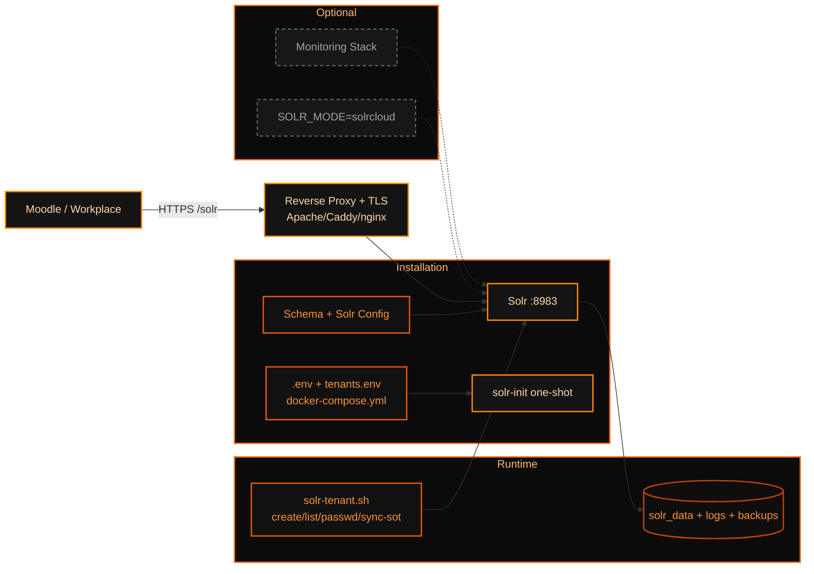

<a id="top"></a>

[](#)


**Solr Docker for Moodle** stellt einen Docker Compose-basierten Apache-Solr-Stack
für die Moodle Global Search bereit — direkt einsetzbar auf jedem Linux-System
mit Docker.

Der Fokus liegt auf einfacher Bereitstellung, sicherer Grundkonfiguration,
persistenten Daten über Docker Volumes, optionalem Monitoring und sauberer
Anbindung über Apache, Caddy oder nginx als Reverse Proxy.

---

## Inhaltsverzeichnis

- [Über das Projekt](#-über-das-projekt)
- [Was ist neu?](#-was-ist-neu)
- [Funktionen](#-funktionen)
- [Architektur](#-architektur)
- [Voraussetzungen](#-voraussetzungen)
- [Schnellstart](#-schnellstart)
- [Konfiguration](#-konfiguration)
- [Moodle-Anbindung](#-moodle-anbindung)
- [Reverse Proxy](#-reverse-proxy)
- [Monitoring](#-monitoring)
- [Tests](#-tests)
- [Verwaltungsbefehle](#-verwaltungsbefehle)
- [Sicherheit](#-sicherheit)
- [Dokumentation](#-dokumentation)
- [Feedback und Beiträge](#-feedback-und-beiträge)
- [Lizenz](#-lizenz)
- [Kontakt](#-kontakt)

---

## 📌 Über das Projekt

**Solr Docker for Moodle** ist ein Docker Compose-basierter Deployment-Stack für
Apache Solr als Backend der Moodle Global Search. Der Stack läuft auf jedem
Linux-System, auf dem Docker installiert ist — kein Ansible, kein Paketmanager
nötig.

Die Lösung verfolgt folgende Ziele:

- **Docker Compose** — ein Befehl, alles läuft
- **Moodle-optimiertes Solr-Schema** — `moodle_schema.xml` mit 24 Feldern
- **Persistente Daten** — alle Laufzeitdaten in Docker Volumes
- **BasicAuth via RBAC** — drei getrennte Nutzerrollen (admin, support, customer)
- **TLS-Terminierung über Apache, Caddy oder nginx auf dem Docker Host**
- **Multi-Tenant-Unterstützung** — mehrere isolierte Moodle-Instanzen pro Solr

---

## 🆕 Was ist neu?

### Version 3.5.0

**Funktionen**

- `solr-init`-Container für Berechtigungs- und Konfigurationssetup vor dem Start
- Netzwerksegmentierung: `frontend_network` (extern) und `backend_network` (intern)
- REST Health API auf Port `8888` (Python, immer aktiv)
- Vollständiger Monitoring-Stack via Docker Compose Profile
  (`--profile monitoring`, `--profile exporter-only`)
- Optionaler Backup-Cron-Service via `--profile backup`
- Optionaler Log-Rotation-Service via `--profile logrotate`
- Multi-Tenant-Management via `make tenant-create/delete/list`
- Preflight-Check vor jedem Start (Docker, Ports, Disk, RAM)
- Double-SHA256-Passwort-Hashing via `scripts/hash-password.py`

**Verbesserungen**

- Solr bindet ausschließlich auf `127.0.0.1` (nie `0.0.0.0`)
- Alle Laufzeitdaten in benannten Docker Volumes (keine Bind-Mounts für Daten)
- G1GC-Tuning im Compose-File voreingestellt
- Ressource-Limits für alle Container

Siehe [CHANGELOG.md](CHANGELOG.md) für Details.

---

## ✅ Funktionen

| Funktion | Status | Beschreibung |
|---|---:|---|
| Docker Compose v2 | ✅ | Stack über Compose gesteuert |
| solr-init Container | ✅ | Einmaliger Setup-Container vor Solr-Start |
| Moodle Solr Schema | ✅ | `moodle_schema.xml` mit 24 Feldern |
| Persistente Volumes | ✅ | data, logs, backups als Docker Volumes |
| `.env` Konfiguration | ✅ | Zentrale Steuerung über Umgebungsvariablen |
| Preflight-Checks | ✅ | Prüft Docker, Ports, Disk, RAM vor Start |
| Passwort-Hashing | ✅ | Double SHA-256 via `hash-password.py` |
| BasicAuth / RBAC | ✅ | admin, support, customer — via `security.json` |
| Netzwerksegmentierung | ✅ | frontend- und backend_network getrennt |
| Health REST API | ✅ | REST-Endpunkt `:8888` für Monitoring/Automation |
| Reverse Proxy | ✅ | Apache, Caddy, nginx (extern einzurichten) |
| TLS über Reverse Proxy | ✅ | TLS am Proxy — nicht im Container |
| Multi-Tenant | ✅ | Isolierte Cores + RBAC pro Tenant |
| Backup (Cron) | ✅ | `--profile backup` mit konfigurierbarer Retention |
| Log-Rotation | ✅ | `--profile logrotate` |
| Solr Exporter | ✅ | `--profile exporter-only` für Remote-Prometheus |
| Prometheus | Optional | `--profile monitoring` |
| Grafana | Optional | `--profile monitoring`, 10 vorinstallierte Panels |
| Alertmanager | Optional | `--profile monitoring`, 14 Alert-Rules |

---

## 🏗 Architektur



Installationsprozess:
- `.env`/`tenants.env` setzen, Compose starten, `solr-init` bootstrappt, Solr fährt hoch.

Runtime-Prozess:
- Moodle spricht über Proxy mit Solr; Tenant- und SoT-Operationen laufen über `solr-tenant.sh`.
- Daten/Logs/Backups sind persistent; SolrCloud und Monitoring optional.

Hinweis: Nur Docker-Stack, kein Ansible-Pfad.

---

## 📋 Voraussetzungen

| Komponente | Empfehlung |
|---|---|
| Betriebssystem | Linux (getestet: Debian, HC-Cloud) |
| Docker | Engine 20.10+, getestet mit 28.5.1 |
| Docker Compose | v2.0+, getestet mit 2.40.3 |
| Moodle | 4.1 bis 5.x |
| Solr | 9.9.0 (im Image enthalten) |
| Reverse Proxy | Apache, Caddy oder nginx — separat einzurichten |
| RAM | mindestens 4 GB, empfohlen 8 GB+ |
| CPU | mindestens 2 vCPU empfohlen |
| Disk | mindestens 20 GB |

---

## 🚀 Schnellstart

```bash
# Repository klonen
git clone https://github.com/Codename-Beast/solr-docker.git
cd solr-docker

# .env aus Vorlage anlegen
make init

# .env bearbeiten — Passwörter setzen!
nano .env

# Konfiguration generieren (security.json + Passwort-Hashing)
make config

# Stack starten (inkl. Preflight-Check)
make start

# Moodle-Core anlegen
make create-core

# Status prüfen
make health
```

Solr direkt prüfen:

```bash
curl http://127.0.0.1:8983/solr/admin/ping
```

Erwartete Antwort:

```json
{
  "status": "OK"
}
```

Health API prüfen:

```bash
curl http://localhost:8888/health
```

Erwartete Antwort:

```json
{
  "customer": "moodle_customer",
  "status": "healthy",
  "solr": { "available": true, "version": "9.9.0" },
  "cores": [{ "name": "moodle_customer_core", "numDocs": 0 }]
}
```

---

## ⚙️ Konfiguration

Die Hauptkonfiguration erfolgt über `.env`. Die Datei wird von `make init` aus
`.env.example` erzeugt und von `make config` für die Passwort-Generierung genutzt.

```env
# Projekt / Kundenname (Präfix für alle Container und Volumes)
CUSTOMER_NAME=moodle_customer

# Solr
SOLR_VERSION=9.9.0
SOLR_PORT=8983
SOLR_BIND_IP=127.0.0.1       # nie ändern — Proxy übernimmt externen Zugriff
SOLR_HEAP_SIZE=2g
SOLR_LOG_LEVEL=INFO

# Authentifizierung (Pflichtfelder — Standardwerte ändern!)
SOLR_ADMIN_USER=admin
SOLR_ADMIN_PASSWORD=change-me-admin
SOLR_SUPPORT_USER=support
SOLR_SUPPORT_PASSWORD=change-me-support
SOLR_CUSTOMER_USER=customer
SOLR_CUSTOMER_PASSWORD=change-me-customer

# Health API
HEALTH_API_PORT=8888

# Backup (aktiv mit --profile backup)
BACKUP_RETENTION_DAYS=30
```

> Alle Passwörter werden von `make config` via `scripts/hash-password.py`
> (Double SHA-256) gehasht und in `config/security.json` geschrieben.

Siehe [docs/configuration.md](docs/configuration.md) für die vollständige Variablen-Referenz.

---

## 🔗 Moodle-Anbindung

In Moodle wird Solr unter Global Search konfiguriert:

```
Website-Administration → Plugins → Suche → Globale Suche verwalten
```

Typische Werte:

| Moodle Einstellung | Wert |
|---|---|
| Suchmaschine | Solr |
| Solr-Hostname | Domain des Reverse Proxy (z. B. `solr.example.org`) |
| Port | `443` (HTTPS über Reverse Proxy) |
| Indexname | `<CUSTOMER_NAME>_core` |
| Benutzer | `customer` |
| Passwort | Wert aus `.env` (`SOLR_CUSTOMER_PASSWORD`) |
| SSL | aktiviert |

Verbindung aus Moodle testen:

```bash
curl -u customer:password \
  http://127.0.0.1:8983/solr/<CUSTOMER_NAME>_core/admin/ping
```

Indexierung starten:

```bash
sudo -u www-data php admin/cli/scheduled_task.php \
  --execute='\\core\\task\\search_index_task'
```

---

## 🌐 Reverse Proxy

Solr bindet auf `127.0.0.1:8983`. Der Reverse Proxy wird **separat auf dem
Docker Host** eingerichtet und leitet HTTPS-Anfragen intern an Solr weiter.

### Apache

```apache
<VirtualHost *:443>
    ServerName solr.example.org

    SSLEngine on
    SSLCertificateFile    /etc/letsencrypt/live/solr.example.org/fullchain.pem
    SSLCertificateKeyFile /etc/letsencrypt/live/solr.example.org/privkey.pem

    ProxyPreserveHost On
    ProxyPass        /solr http://127.0.0.1:8983/solr
    ProxyPassReverse /solr http://127.0.0.1:8983/solr

    <Location /solr>
        Require all granted
    </Location>
</VirtualHost>
```

### Caddy

```caddyfile
solr.example.org {
    reverse_proxy /solr/* 127.0.0.1:8983
}
```

### nginx

```nginx
server {
    listen 443 ssl;
    server_name solr.example.org;

    ssl_certificate     /etc/letsencrypt/live/solr.example.org/fullchain.pem;
    ssl_certificate_key /etc/letsencrypt/live/solr.example.org/privkey.pem;

    location /solr/ {
        proxy_pass         http://127.0.0.1:8983/solr/;
        proxy_set_header   Host              $host;
        proxy_set_header   X-Real-IP         $remote_addr;
        proxy_set_header   X-Forwarded-Proto https;
        proxy_read_timeout 300s;
    }
}
```

Siehe [docs/reverse-proxy.md](docs/reverse-proxy.md) für weitere Beispiele.

---

## 📊 Monitoring

Der Stack unterstützt drei Monitoring-Modi via Docker Compose Profile:

```bash
# Ohne Monitoring (Standard — Solr + Health API)
docker compose up -d

# Nur Solr Exporter (für externen Prometheus-Server)
docker compose --profile exporter-only up -d

# Vollständiger lokaler Monitoring-Stack
docker compose --profile monitoring up -d
```

Beim vollständigen Monitoring-Stack:

| Dienst | Port | Netzwerk | Beschreibung |
|---|---|---|---|
| `solr-exporter` | `127.0.0.1:9854` | backend | Prometheus Metrics |
| `prometheus` | `127.0.0.1:9090` | backend | Zeitreihen-DB |
| `grafana` | `0.0.0.0:3000` | frontend | 10 Panels vorinstalliert |
| `alertmanager` | `127.0.0.1:9093` | backend | 14 Alert-Rules |

```bash
make monitoring-up     # Monitoring-Stack starten
make grafana           # Grafana im Browser öffnen (admin/admin)
make prometheus        # Prometheus im Browser öffnen
```

> Grafana im Produktivbetrieb ebenfalls hinter Reverse Proxy absichern
> (`GRAFANA_BIND_IP=127.0.0.1`).

Siehe [docs/monitoring.md](docs/monitoring.md) für Details.

---

## 🧪 Tests

| Test | Datei | Zweck |
|---|---|---|
| Preflight-Check | `scripts/preflight-check.sh` | Docker, Ports, Disk, RAM |
| Integration Test | `tests/integration-test.sh` | Stack, Auth, Core, Indexierung |
| Multi-Tenant Test | `tests/multi-tenant-test.sh` | Tenant-Isolation und RBAC |
| Security-Scan | `scripts/security-scan.sh` | Trivy Image-Scan |
| Benchmark | `scripts/benchmark.sh` | Performance-Messung |

```bash
# Integrationstests
make test

# Multi-Tenant-Tests
./tests/multi-tenant-test.sh

# Solr Ping
curl -f http://127.0.0.1:8983/solr/admin/ping

# Auth-Test (customer-User)
curl -u customer:password \
  "http://127.0.0.1:8983/solr/<CUSTOMER_NAME>_core/select?q=*:*&rows=0"

# Health API
curl -f http://localhost:8888/health
```

Siehe [docs/testing.md](docs/testing.md) für Details.

---

## 🏷 Verwaltungsbefehle

```bash
make help              # Alle Befehle anzeigen
```

### Hauptoperationen

```bash
make init              # .env aus .env.example anlegen
make config            # security.json + Config generieren
make start             # Preflight-Check + Stack starten
make stop              # Stack stoppen
make restart           # Stop + Start
make logs              # Solr-Logs live anzeigen
make health            # Health-Check ausführen
make dashboard         # Statusübersicht
make create-core       # Moodle-Core anlegen
make backup            # Manuelles Backup
make clean             # Container entfernen
make destroy           # Alles löschen ⚠️ (inkl. Volumes)
```

### Monitoring

```bash
make monitoring-up     # Monitoring-Stack starten
make monitoring-down   # Monitoring-Stack stoppen
make grafana           # Grafana im Browser öffnen
make prometheus        # Prometheus im Browser öffnen
make alertmanager      # Alertmanager im Browser öffnen
make metrics           # Solr-Metriken ausgeben
```

### Multi-Tenant

```bash
make tenant-create TENANT=schule_a          # Tenant anlegen
make tenant-delete TENANT=schule_a          # Tenant löschen
make tenant-delete TENANT=schule_a BACKUP=true  # Mit Backup davor
make tenant-list                            # Alle Tenants anzeigen
make tenant-backup TENANT=schule_a          # Einzelnen Tenant sichern
make tenant-backup-all                      # Alle Tenants sichern
```

---

## 🔒 Sicherheit

Empfehlungen:

- `SOLR_BIND_IP=127.0.0.1` — Solr niemals direkt öffentlich exponieren.
- TLS am Reverse Proxy terminieren — nicht im Container.
- Alle Standardpasswörter in `.env` vor dem ersten `make start` ändern.
- Passwörter werden via Double SHA-256 gehasht (`scripts/hash-password.py`).
- Drei getrennte Nutzerrollen: `admin` (voll), `support` (read + metrics), `customer` (read + update).
- `config/security.json` nicht in Versionskontrolle einchecken.
- Grafana im Produktivbetrieb hinter Reverse Proxy mit Authentifizierung.
- Regelmäßig `make security-scan` (Trivy) ausführen.

Passwort manuell hashen:

```bash
python3 scripts/hash-password.py "mein-sicheres-passwort"
```

Siehe [docs/security.md](docs/security.md) für Details.

---

## 📚 Dokumentation

| Dokument | Beschreibung |
|---|---|
| [docs/configuration.md](docs/configuration.md) | Vollständige `.env`-Variablen-Referenz |
| [docs/reverse-proxy.md](docs/reverse-proxy.md) | Apache, Caddy, nginx Konfigurationen |
| [docs/monitoring.md](docs/monitoring.md) | Prometheus, Grafana, Alertmanager |
| [docs/security.md](docs/security.md) | Passwort-Hashing, RBAC, Docker Secrets |
| [docs/multi-tenancy.md](docs/multi-tenancy.md) | Multi-Tenant-Setup und -Verwaltung |
| [docs/testing.md](docs/testing.md) | Integrations- und Multi-Tenant-Tests |
| [CHANGELOG.md](CHANGELOG.md) | Versionshistorie |

---

## 💬 Feedback und Beiträge

Issues und Pull Requests sind willkommen.

---

## 📄 Lizenz

Dieses Projekt folgt der Apache License 2.0 (entsprechend Apache Solr).

---

## 📬 Kontakt

- **Autor:** Bernd Schreistetter / BSC
- **Firma:** eLeDia (Eledia GmbH)
- **Projekt:** Solr Docker for Moodle
- **Version:** die Aktuelle

[Zurück nach oben](#top)
